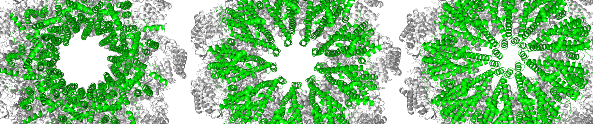

# AlphaFold unmasked <br><sup>to integrate experiments and predictions</sup>



## On Google Colab

A simplified version of AF_unmasked is available to run as notebook on Google Colab. Try it by clicking on the button below:

[](https://colab.research.google.com/github/clami66/AF_unmasked/blob/notebook/notebooks/AF_unmasked.ipynb)

## Installing AF_unmasked

The installation and setup procedure is the same as for the regular version of AlphaFold (non-docker version). We recommend Anaconda and mamba along with pip3 to manage the necessary software packages:

1. [Install Anaconda/Miniconda](https://conda.io/projects/conda/en/latest/user-guide/install/index.html)

2. Set up conda environment, install dependencies:

```bash
# clone this repository
git clone https://github.com/clami66/AF_unmasked.git
cd AF_unmasked/

# install requirements
# NB: **better if you can use mamba instead of conda (mamba env create...)**
conda env create --file=environment.yaml

# NB: **on M1/M2 Macbooks, this should be:
# CONDA_SUBDIR=osx-64 conda env create --file=environment.yaml

conda activate AF_unmasked

python -m pip install -r requirements.txt
```

3. [optional] Download and set up the AF parameters and sequence databases. We recommend downloading the reduced set of databases since evolutionary inputs are not as important when a good template is provided. If the full databases are needed, run the following by omitting `reduced_dbs`:

```bash
cd scripts
chmod +x download_all_data.sh

./download_all_data.sh ../AF_data/ reduced_dbs
```

If you have databases and parameters from a precedent AlphaFold installation, it is not necessary to repeat this step, just make sure that the paths inside `databases.flag` point to the right directories.

We recommend using the "v2" multimer parameter files. These will be downloaded automatically when running `download_all_data.sh`

4. [optional] Install [lDDT_align](https://github.com/clami66/lDDT_align) if you want to perform superposition-free structural alignments

## Preparing multimeric templates

This version of AlphaFold comes with a python script `prepare_templates.py` to set up multimeric templates before a run.

**Quick start**

If you have a `.fasta` file containing multiple sequences:

```
>H1142,subunit1|_0
GLEKDFLPLYFGWFLTKKSSETLRKAGQ...
>H1142,subunit2|_0
EVQLEESGGGLVQAGGSLTLSCAASGFT...
```

And a `.pdb`/`.cif` file containing as many template chains as there are target chains in the fasta file, you can run e.g.:

```
python prepare_templates.py --target examples/H1142/H1142.fasta \
    --template examples/H1142/H1142.pdb \
    --output_dir AF_models/ \
```

When using a `.fasta` target, the outputs will be saved in a subfolder inside `output_dir` with the same name as the fasta file. In this case, the outputs will be stored inside `AF_models/H1142` because the fasta filename is `H1142.fasta`.

**Chain mapping flags**

The previous example assumes that the first chain in the `.fasta` file maps to the first chain in the `.pdb` template, and so on. If not, it is necessary to specify the mapping. For example, if the first sequence in the `.fasta` file maps to the `B` chain in the template, and the second sequence maps to the `C` chain in the template, you can run:

```
python prepare_templates.py --target examples/H1142/H1142.fasta \
    --template examples/H1142/H1142.pdb \
    --output_dir AF_models/ \
    --target_chains A B \
    --template_chains B C
```

The `--target_chains`/`--template_chains` mapping flags are also necessary when the template contains more/fewer chains than there are sequences in the input `.fasta` file.

**Partial templates**

If a template only covers a subset of the target sequences, you must specify this in the template preparation step. If, for example, a dimer template `AB` is available for a trimeric complex `ABC`, then you must specify which two sequences are covered by the template:

```
python prepare_templates.py --target examples/H1142/H1142.fasta \
    --template examples/H1137/H1137.pdb \
    --output_dir AF_models/ \
    --target_chains A B C \
    --template_chains A B -
```

Where the `-` placeholder specifies which target chain will not be covered by the template (in this case, target chain `C`).

**Input structures instead of sequences**

It is possible to prepare templates starting from `.pdb`/`.cif` files instead of `.fasta` sequences. This is useful, for example, when the user wants to start from monomeric predictions of each target chain and align them against a multimer template structure. For example, if two unbound structures for chains `A` and `B` are available in PDB format:

```
python prepare_templates.py --target examples/H1142/casp15_predictions/unbound_chain_A.pdb \
    examples/H1142/casp15_predictions/unbound_chain_B.pdb \
    --template examples/H1142/H1142.pdb \
    --output_dir AF_models/H1142 \
```

NB: in this case, the user needs to manually add to the output directory the name of the `.fasta` file that will be used in the AlphaFold run (`H1142.fasta` -> `--output_dir AF_models/H1142`).

The target chains can also come from the same PDB file, in that case it might be necessary to provide the chain mapping flags:

```
python prepare_templates.py --target examples/H1142/casp15_predictions/unbound_chains.pdb \
    --template examples/H1142/H1142.pdb \
    --output_dir AF_models/H1142 \
    --target_chains A B \
    --template_chains B C
```

The target/template files are in `.pdb` format by default, but mmCIF is also supported. The `--mmcif_target`/`--mmcif_template` flags are expected in that case.

**Templates that are remote homologs**

By default, `AF_unmasked` lets AlphaFold perform alignments between templates and targets. If you want to control the alignment step, you can force this behavior with the `--align` flag:

```
python prepare_templates.py --target examples/H1142/H1142.fasta \
    --template examples/H1142/H1142.pdb \
    --output_dir AF_models/ \
    --align
```

which will generate `pdb_hits.sto` alignments files in the `msa/` folders.

If you have monomeric structures for all units in the complex, you can make so that the alignments are structural (with `TM-align` or `lDDT_align`):

```
python prepare_templates.py --target examples/H1142/casp15_predictions/unbound_chain_A.pdb \
    examples/H1142/casp15_predictions/unbound_chain_B.pdb \
    --template examples/H1142/H1142.pdb \
    --output_dir AF_models/ \
    --align
    --align_tool tmalign # or lddt_align`
```

In some cases, it might be useful to superimpose unbound monomers onto the template to create a coarse interaction model. Then, the coarse model made from putting together the unbound monomers will be itself used as template. This can be done with the `--superimpose` flag:

```
python prepare_templates.py --target examples/H1142/casp15_predictions/unbound_chain_A.pdb \
    examples/H1142/casp15_predictions/unbound_chain_B.pdb \
    --template examples/H1142/H1142.pdb \
    --output_dir AF_models/H1142 \
    --superimpose
```

**Adding further templates**
AlphaFold takes up to four structural templates as input. Once the first template has been generated with `prepare_templates.py`, three more can be added with the `--append` flag. These can be the same template as the first, repeated three more times, or different templates:

```
# prepare the first template
python prepare_templates.py --target examples/H1142/H1142.fasta --template examples/H1142/H1142.pdb --output_dir AF_models/
# running the same command three more times to fill the four template slots while using different templates
python prepare_templates.py --target examples/H1142/H1142.fasta --template examples/H1142/H1142.pdb --output_dir AF_models/ --append
python prepare_templates.py --target examples/H1142/H1142.fasta --template examples/H1142/H1142.pdb --output_dir AF_models/ --append
python prepare_templates.py --target examples/H1142/H1142.fasta --template examples/H1142/H1142.pdb --output_dir AF_models/ --append
```

**Inpainting of clashing residue pairs**

When templates have clasing sets of amino acids, these are automatically detected and deleted by `prepare_tempalates.py` so that they can be inpainted during the predictions step. This behavior is enabled by default, but may be disabled with the `--noinpaint_clashes` flag:

```
python prepare_templates.py --target examples/H1142/H1142.fasta \
    --template examples/H1142/H1142.pdb \
    --output_dir AF_models/ \
    --noinpaint_clashes
```

## Outputs

Having run `prepare_templates.py` four times (one per template), the output directory `AF_models/` will look as follows:

```bash
AF_models/H1142/
├── H1142.fasta  # target fasta file
├── H1142.pdb    # template pdb file
├── msas
│   ├── A
│   │   └── pdb_hits.sto # only if --align is used
│   ├── B
│   │   └── pdb_hits.sto # only if --align is used
...
└── template_data
    ├── mmcif_files
    │   ├── 0000.cif
    │   ├── 0001.cif
    │   ├── 0002.cif
    │   └── 0003.cif
    ├── pdb_seqres.txt
    └── templates.flag
```

The `template_data/` subfolder mimics AlphaFold's database of PDB structures, where only four PDB structures are included (one per template). Whatever the name of the template, the `.cif` PDB files are renumbered from 0000 to 0003.

The `msas/` folder contains the alignments to map the target sequence onto the template coordinates if the `--align` flag was used. AlphaFold will not overwrite the files if they have been generated in the template preparation step.

`template_data/templates.flag` is a flagfile that should be passed to AlphaFold when it's time to perform a prediction. It cointains the information AlphaFold needs to find all the necessary template/alignment information as it's been generate by `prepare_templates.py`.

## Running AlphaFold


Once templates have been prepared, invoke AlphaFold with the generated flagfile (inside the `template_data` folder) along with the standard flagfile (`databases.flag` in this repository):

```
python run_alphafold.py --fasta_paths examples/H1142/H1142.fasta \
    --flagfile ./databases.flag \
    --flagfile examples/H1142/template_data/templates.flag \ # the template flagfile generated by prepare_templates.py
    --output_dir AF_models \  # same output folder used with prepare_templates.py
    --model_preset='multimer_v2'
```

**NB: the --output_dir flag should be passed the same directory as when running prepare_templates.py**. So that AlphaFold uses the correct `pdb_hits.sto` files when parsing the template data.

**Neural network models**

From our experiments, the best AF models to use multimeric templates are:

* `model_1_multimer_v2`
* `model_5_multimer_v2`
* `model_1_multimer_v3`
* `model_5_multimer_v3`

In order to save time and resources, we recommend running these models alone. You can use the flag `--models_to_use`, e.g.:

```
python run_alphafold.py --fasta_paths examples/H1142/H1142.fasta \
    --flagfile ./databases.flag \
    --flagfile examples/H1142/template_data/templates.flag \ # the template flagfile generated by prepare_templates.py
    --output_dir AF_models \  # same output folder used with prepare_templates.py
    --models_to_use=model_1_multimer_v2,model_1_multimer_v3,model_5_multimer_v2,model_5_multimer_v3
```

This will generate 4 * 5 = 20 predictions. You can encourage additional sampling, similarly to [AF_sample](https://github.com/bjornwallner/alphafoldv2.2.0), with the `--dropout` and `--num_multimer_predictions_per_model` flags:

```
python run_alphafold.py --fasta_paths examples/H1142/H1142.fasta \
    --flagfile ./databases.flag \
    --flagfile examples/H1142/template_data/templates.flag \ # the template flagfile generated by prepare_templates.py
    --output_dir AF_models \  # same output folder used with prepare_templates.py
    --models_to_use=model_1_multimer_v2,model_1_multimer_v3,model_5_multimer_v2,model_5_multimer_v3
    --dropout
    --num_multimer_predictions_per_model 100
```

Which will generate 4 * 100 = 400 predictions.

Cross-chain restraints from templates are enabled by default. You can use the flag `--cross_chain_templates_only` to only use inter-chain constraints and disregard the intra-chain constraints or `--nocross_chain_templates` to disable them altogether (similar to standard AlphaFold).


## Clipping the MSAs to speed up computation

Use the `[uniprot,mgnify,uniref,bfd]_max_hits` flags to limit the number of sequences to include from each alignment file. For example, if we only want to use 200 sequences from mgnify and uniref, while only keeping a single sequence from other alignments:

```
python run_alphafold.py --fasta_paths examples/H1142/H1142.fasta \
    --flagfile ./databases.flag \
    --flagfile examples/H1142/template_data/templates.flag \
    --output_dir AF_models \
    --cross_chain_templates \
    --dropout \
    --model_preset='multimer_v2' \
    --separate_homomer_msas \
    --uniprot_max_hits 1 \
    --mgnify_max_hits 100 \
    --uniref_max_hits 100 \
    --bfd_max_hits 1
```

We usually recommend setting `--uniprot_max_hits 1` on most scenarios so that MSA pairing doesn't interfer with the multimeric templates.

In general, limiting the number of alignments from MSAs forces AlphaFold to rely more on the templates, while speeding up computation. Maximum speedup is achieved by making sure that the maximum total number of sequences in the final alignment is no more than 512.

## Predicting homomers

Whenever predicting homomers (or multimers containing multiple copies of any given chain) the `--separate_homomer_msas` flag (enabled by default) forces AlphaFold to use separate MSAs, one for each chain, rather than a single one for all identical chains. This behavior can be disabled with `--noseparate_homomer_msas`.

## References

If you use AF_unmasked you can cite the preprint [on BioRxiv](https://doi.org/10.1101/2023.09.20.558579)

As well as the original [AlphaFold](https://doi.org/10.1038/s41586-021-03819-2) and [AlphaFold-Multimer](https://www.biorxiv.org/content/10.1101/2021.10.04.463034v1) papers.
